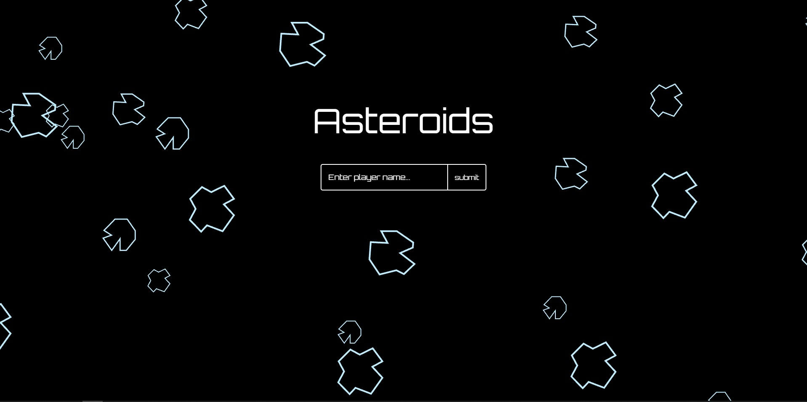
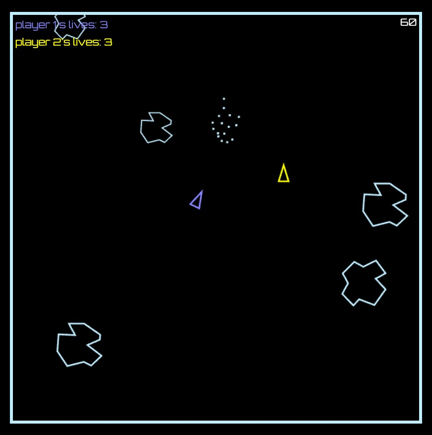

# Multiplayer Asteroids

 

## Overview

This project implements a multiplayer version of Atari asteroids using React, TypeScript, and Node.js.

Users can create or join games of up to six players, then fly around destroying asteroids and alien ships together.

## How to Play the Game

### Option 1: Raspberry Pi Deployment

There is a Raspberry Pi hosted deployment of this project. Play the game by going to http://asteroidsgames.com

### Option 2: Local Setup

To run this project locally, do thse following:

1. Clone this repo
2. cd into `webgames-asteroids`
3. To run in docker containers...
    1. cd into `frontend` directory
    2. Run: `docker build --no-cache -f Dockerfile -t asteroids-frontend:latest .`
    3. Run: `docker run -d -p 80:80 --name asteroids-frontend asteroids-frontend:latest`
    4. Open a new terminal
    5. cd into `/webgames-asteroids/backend` directory
    6. Run: `docker build --no-cache -f Dockerfile -t asteroids-backend:latest .`
    7. Run: `docker run -d -p 4000:4000 --name asteroids-backend asteroids-backend:latest`
    8. Wait a couple seconds and you're ready to rock and role
4. To run natively...
    1. cd into `frontend` directory
    2. Run: `npm install`
    3. Run: `npm start`
    4. Open a new terminal
    5. cd into `/webgames-asteroids/backend` directory
    6. Run: `npm install`
    7. Run: `npm start`
